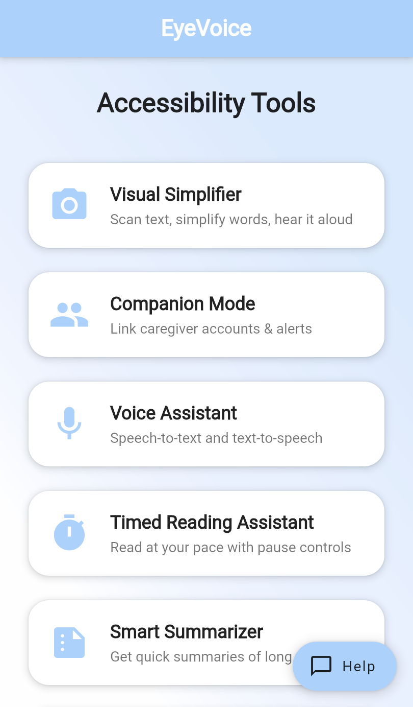
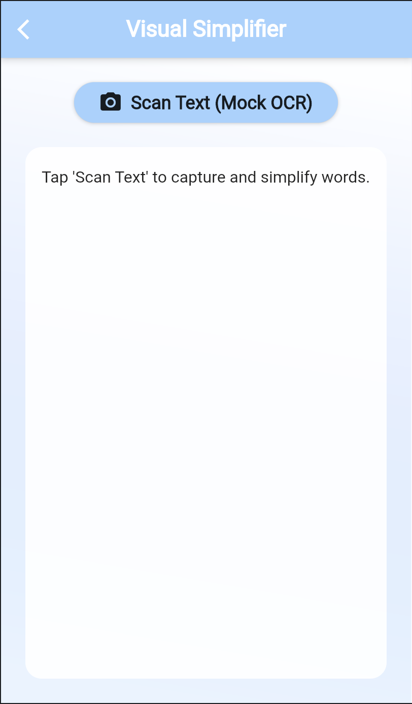
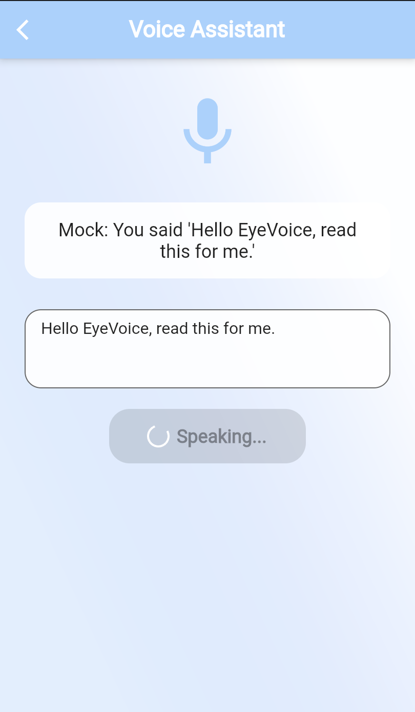
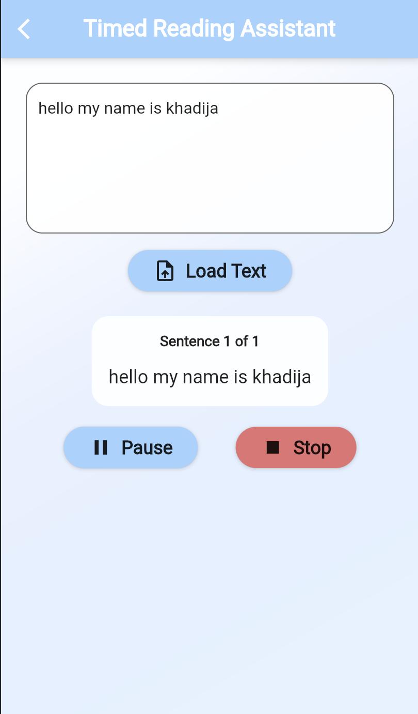
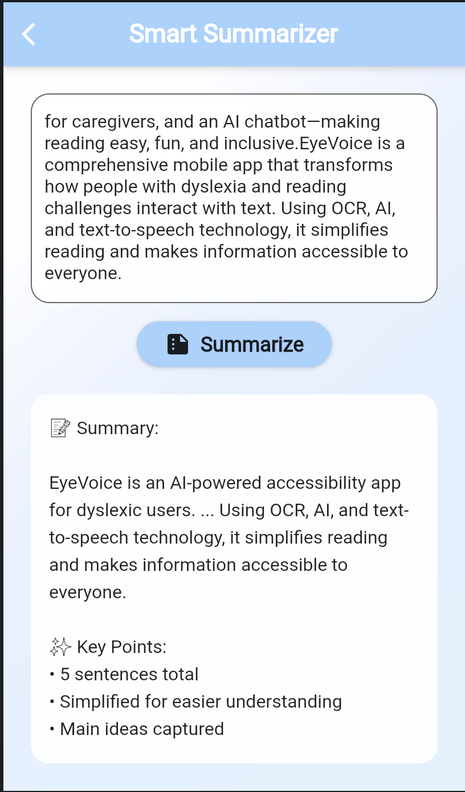
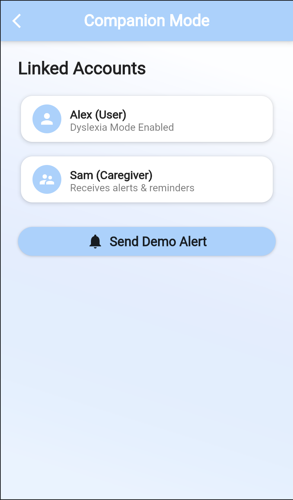

# 👁️ EyeVoice - Making Reading Accessible for Everyone

<div align="center">

**An AI-powered accessibility app designed for dyslexic users and anyone with reading difficulties.**

[🌐 Live Website](https://jolly-monstera-18c267.netlify.app/) • [📱 Try Demo](https://zruc060xrud0.zapp.page/#/) 

</div>

---

## 🎯 What is EyeVoice?

EyeVoice is a comprehensive mobile app that transforms how people with dyslexia and reading challenges interact with text. Using OCR, AI, and text-to-speech technology, it simplifies reading and makes information accessible to everyone.

<div align="center">  <p><em>EyeVoice Home Screen - All accessibility tools in one place</em></p> </div>

### ✨ Key Highlights

- 📸 **Scan & Simplify** any printed text instantly
- 🎙️ **Voice Assistant** for hands-free reading
- ⏱️ **Timed Reading** at your own pace
- 📝 **Smart Summaries** of long passages
- 👥 **Family Support** through Companion Mode
- 💬 **AI Chatbot** for instant guidance

---

## 🚀 Features

### 1. 📸 Visual Simplifier
Transform complex text into simple, easy-to-read content.
<div align="center">  </div>

- **OCR Text Scanning**: Point your camera at any text
- **Word Simplification**: "comprehensive" → "complete", "utilize" → "use"
- **Instant Results**: Process text in under 2 seconds
- **Read Aloud**: Hear the simplified version immediately

**Use Case**: Reading menus, signs, documents, or textbooks becomes effortless.

---

### 2. 🎙️ Voice Assistant
Speak or type, and hear it back in natural-sounding speech.
<div align="center">  </div>

- **Text-to-Speech**: Natural voice reads any text aloud
- **Speech-to-Text**: Speak instead of typing
- **Adjustable Speed**: Control reading pace
- **Offline Mode**: Works without internet

**Use Case**: Perfect for emails, messages, and articles.

---

### 3. ⏱️ Timed Reading Assistant
Read long text sentence-by-sentence at your own pace.
<div align="center">  </div>

- **Pause Between Sentences**: Take breaks as needed
- **Progress Tracking**: Remember where you stopped
- **Visual Highlighting**: Follow along easily
- **Speed Control**: Adjust reading speed

**Use Case**: Ideal for studying, homework, and comprehension exercises.

---

### 4. 📝 Smart Context Summarizer
Get the main points without reading everything.
<div align="center">  </div>

- **Auto-Summarization**: Condense long passages
- **Key Points**: Extract important information
- **Simple Language**: Easy-to-understand summaries
- **Save Time**: Focus on what matters

**Use Case**: Quickly understand news articles, reports, and research papers.

---

### 5. 👥 Companion Mode
Stay connected with family and caregivers.
<div align="center">  </div>

- **Link Accounts**: Connect with family members
- **Share Alerts**: Send reminders and notifications
- **Activity Monitoring**: Caregivers can track progress
- **Two-Way Communication**: Stay in touch

**Use Case**: Parents, teachers, and caregivers can provide support remotely.

---

### 6. 💬 AI Help Assistant
Your personal guide to using the app.
<div align="center">  </div>

- **24/7 Availability**: Help anytime, anywhere
- **Natural Conversations**: Ask questions in plain language
- **Feature Tutorials**: Learn how to use every tool
- **Instant Answers**: No waiting for support

**Use Case**: New users can learn the app quickly and easily.

---

## 🎨 Why EyeVoice Matters

### The Problem
- **1 in 10 people** worldwide have dyslexia
- Reading difficulties create barriers to education, work, and daily life
- Existing tools are expensive, complicated, or ineffective

### Our Solution
- **Free & Accessible**: No subscriptions or hidden costs
- **Easy to Use**: Intuitive design, no learning curve
- **Proven Technology**: OCR, AI, and TTS in one app
- **Privacy First**: All processing happens on your device

### Real Impact
> *"I used to struggle with reading menus and signs. Now I just scan them with EyeVoice and understand instantly!"* - Agher, 82

> *"As a doctor, I recommend this to all my dyslexic patients. It's a game-changer."* - Dr Zehra

---

## 📱 Installation

### Prerequisites
- **Android**: 8.0 (Oreo) or higher
- **iOS**: iOS 12 or higher
- **Storage**: ~25MB free space

### Quick Start

```bash
# Clone the repository
git clone https://github.com/4khadija/eyevoice.git

# Navigate to project
cd eyevoice

# Install dependencies
flutter pub get

# Run the app
flutter run
```

### Download APK
Coming soon on Google Play Store!

---

## 🛠️ Technology Stack

| Technology | Purpose |
|------------|---------|
| **Flutter** | Cross-platform app framework |
| **Dart** | Programming language |
| **Web Speech API** | Text-to-speech synthesis |
| **OCR (Mock)** | Text recognition from images |
| **Material Design** | Beautiful, accessible UI |

---

## 🎯 Usage Examples

### Example 1: Reading a Restaurant Menu
1. Open **Visual Simplifier**
2. Point camera at menu
3. App scans and simplifies text
4. Tap **Read Aloud** to hear it

### Example 2: Studying for an Exam
1. Open **Timed Reading Assistant**
2. Paste study material
3. Click **Start Reading**
4. Read sentence-by-sentence at your pace

### Example 3: Understanding a Long Email
1. Copy email text
2. Open **Smart Summarizer**
3. Get key points in seconds
4. Understand the main message quickly

---

## 🌟 What Makes EyeVoice Different?

| Feature | Other Apps | EyeVoice |
|---------|-----------|----------|
| **Price** | $5-15/month | Free |
| **Ease of Use** | Complex | Simple |
| **All-in-One** | Single feature | 6 features |
| **Privacy** | Cloud-based | Local processing |
| **Support** | Email only | AI chatbot 24/7 |
| **Design** | Generic | Dyslexia-optimized |

---

## 🤝 Contributing

I welcome contributions! Here's how you can help:

1. **Report Bugs**: Open an issue with details
2. **Suggest Features**: Share your ideas
3. **Improve Code**: Submit a pull request
4. **Spread the Word**: Tell others about EyeVoice

### Development Setup

```bash
# Fork the repository
git fork https://github.com/4khadija/eyevoice.git

# Create a feature branch
git checkout -b feature/amazing-feature

# Make your changes
git commit -m "Add amazing feature"

# Push to your fork
git push origin feature/amazing-feature

# Open a Pull Request
```

---

## 🗺️ Roadmap

### Coming Soon
- [ ] PDF file import and reading
- [ ] Multi-language support (Spanish, French, German)
- [ ] Custom word dictionaries
- [ ] Reading statistics dashboard
- [ ] Google Play Store release
- [ ] iOS App Store release

### Future Plans
- [ ] Integration with learning platforms
- [ ] Voice-controlled navigation
- [ ] Audiobook creation from documents
- [ ] Collaborative reading sessions
- [ ] Browser extension

---

<div align="center">

**Made with ❤️ for the dyslexia community**

[⬆ Back to Top](#-eyevoice---making-reading-accessible-for-everyone)

</div>
